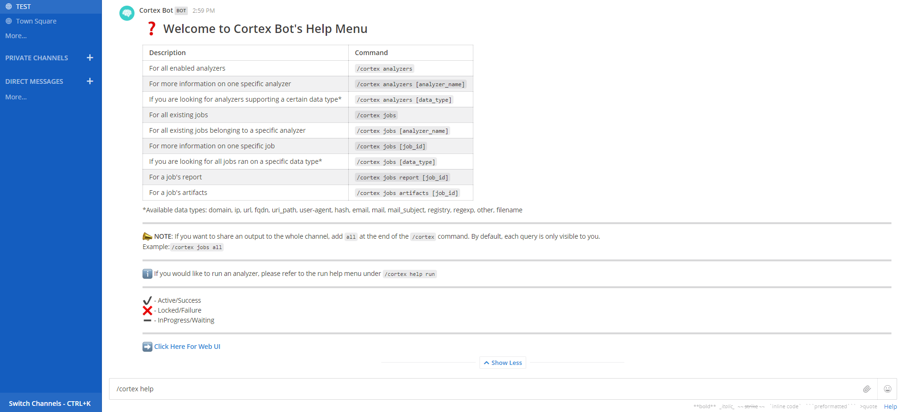

# Cortex Bot
Cortex Bot is simple python script that allows you to integrate Cortex in a Mattermost instance. With it, you can query Cortex requests and run jobs directly from your Mattermost interface. It is used by calling the ´/cortex´ command from Mattermost's chat window. 



# Features
With Cortex Bot you can:
 - Find all enabled analyzers
 - Find all enabled analyzers by data type
 - Find information on a specific enabled analyzer
 - Find all existing jobs
 - Find all existing jobs by data type or analyzer
 - Find information on a specific existing job
 - Get the report and artifacts of an existing job
 - Run a job by analyzer name (in which you can input the data type, data, tlp and cache bypassing parameter)
 - Run all jobs by specific data types
 
All this from your Mattermost instance!

# Required

- Apache HTTP Server (httpd)
- Python v3.5+
- mod_wsgi Python v3.5+
- Cortex4py (please refer to cortex4py [documentation](https://github.com/TheHive-Project/Cortex4py) for installation)

# Set Up

For the correct set up of Cortex Bot, it is crucial that httpd is installed and running. The scripts are written in python3 and communicate with Cortex instances via cortex4py. In order to execute the scripts from cgi, the python Apache Server module mod_wsgi is required. This will provide a WSGI inteface for Python and and allows the integration with cgi. Once the aforementioned configurations and installations are done, proceed by placing cortex_bot_cgi.py, cortex_bot_push.py and the formats directory in /var/www/cgi-bin. 

**:heavy_exclamation_mark: Note**: cortex_bot_cgi.py will need execute privileges (chmod to 705 is the minimum required).


## Mattermost Configuration


**:heavy_exclamation_mark: Note**: You will need admin privileges in your Mattermost instance to perform the following configurations. 

**1. Add a new custom slash command**

Under Integrations/Slash Command, add a new custom slash command and input the following:
 
* Command Trigger Word: cortex
* request url: http://<ADDRESS_WHERE_APACHE_IS_RUNNING>/cgi-bin/cortex_bot_cgi.py
* request method: GET
* response icon + autocomplete are optional

You will be given a token once the slash command is configured.

**2. Create a new BOT USER and add a new incoming web**

Create a new Bot user in mattermost. Mattermost provides ways for creating Bot users. However, I suggest that you simply create a new normal user account that will only be used by the Cortex Bot. When this is done, log in to the Bot User's account and create an incoming webhook.
Under Integrations/Incoming Webhooks, add a new webhook. Mattermost should then confirm your configuration by providing a URL. Creating a webhook via your Bot User's account has the advantage that, whenever a normal user will run a job later on, incoming webhooks are automatically going to be linked between the user and the bot. 

You might need to add an exception for untrusted internal connections in Mattermost. To do so, go to System Console/Advanced/Developer/Allow untrusted internal connections and add your cortex instance and/or the apache server on which you have placed the cortex bot files.


## Cortex Configuration


Log in your cortex instance and add a new user. This user will have as a purpose to handle communications between mattermost and cortex. When the user is created, generate an API key.


## Code Configuration


Now that Cortex and Mattermost are both configured, you can change the private information in the code.

* In cortex_bot_cgi.py and in cortex_bot_push.py:

Add your cortex instance URL and your cortex user API key in the following line:
```
api = Api('<CORTEX_INSTANCE_URL>','<CORTEX_BOT_USER_API_KEY>')
```

Add your cortex instance URL in the following line: 
```
link = "<CORTEX_INSTANCE_URL>"
```

* In cortex_bot_cgi.py

Add your custom slash command token in the following line:
```
token = "<MATTERMOST TOKEN>"
```

* In cortex_bot_push.py:

Add incoming webhook generated url in the following line:
```
incoming_WH_link = "<MATTERMOST_INCOMING_WEBHOOK_URL>"
```


If you encounter issues running your bot, refer to the Mattermost log files under System Console/logs or see the mattermost [documentation](https://docs.mattermost.com/)

Voila, your cortex bot is now configured and should be ready to go!


