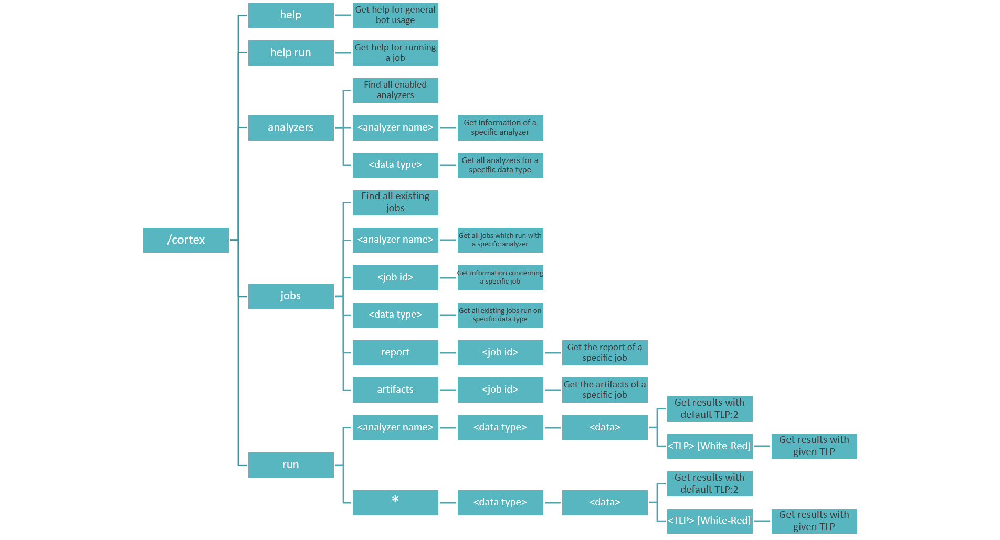

# Usage

The Cortex Bot relies on Cortex's implementation of Analyzers and Jobs. Refer to Cortex's [admin](https://github.com/TheHive-Project/CortexDocs/blob/master/admin/admin-guide.md) guide for more information concerning the use of Cortex. Analyzers and Users must be enabled, disabled and configured via the Cortex Web UI or via its REST API. 

## Architecture

The Cortex Bot is divided into four main parts: Help, Analyzers, Jobs, Run (as illustrated below). Each section allows you to either search for existing jobs and analyzers or to run specific jobs. A query starts by the /cortex command given in the Mattermost message bar. Each query is followed by the information you would like to access. Following the white arguments given in the graph below provides examples of all the possible inputs. 



## Help

Two help menus are accessible via the cortex bot. The basic help menu provides information concerning the possible queries and general information on the bot, and is accessed via the following command: 
```
/cortex help
```


The second help menu can be accessed via the command
```
/cortex help run
```

And provides information regarding running Cortex jobs via Mattermost.

## Analyzers

## Jobs

## Run
