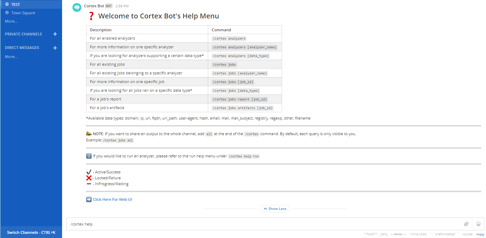
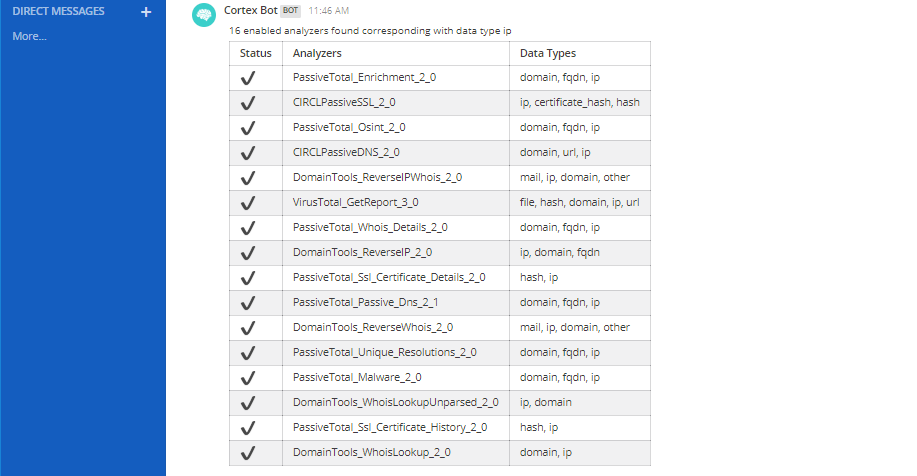

# Usage

The Cortex Bot relies on Cortex's implementation of Analyzers and Jobs. Refer to Cortex's [admin](https://github.com/TheHive-Project/CortexDocs/blob/master/admin/admin-guide.md) guide for more information concerning the use of Cortex. Analyzers and Users must be enabled, disabled and configured via the Cortex Web UI or via its REST API. 

## Architecture

The Cortex Bot is divided into four main parts: Help, Analyzers, Jobs, Run (as illustrated below). Each section allows you to either search for existing jobs and analyzers or to run specific jobs. A query starts by the /cortex command given in the Mattermost message bar. Each query is followed by the information you would like to access. Following the white arguments given in the graph below provides examples of all the possible inputs. 


## Help

Two help menus are accessible via the cortex bot. The basic help menu provides information concerning the possible queries and general information on the bot, and is accessed via the following command
```
/cortex help
```


The second help menu provides information regarding running Cortex jobs via Mattermost AND can be accessed via the command
```
/cortex help run
```


## Analyzers

From the Cortex Bot, you can access information concerning analyzers enabled in your Cortex instance. The bot allows three different options:

- Find all enabled analyzers
- Find detailed information on a specific analyzer
- Find all analyzers which can be run on a specific data type

For example, if the user wants to find information on all enabled analyzers that can be run with ip's, the query would be
```
/cortex analyzers ip
```


## Jobs

To access job information, you have several different options. You can

- Find all existing jobs
- Find the jobs run with a specific analyzer
- Find the jobs run on a specific data type.

For example, to get the jobs that have be run with the analyzer VirusTotal_GetReport_3_0, input
```
/cortex jobs VirusTotal_GetReport_3_0
```

You can also access jobs summary of reports and artifacts. For instance, to get the summary of the report of a job run with the analyzer PassiveTotal_Unique_Resolution_2_0, type the following command
```
/cortex jobs report <job_id>
```


## Run

Lastly, Cortex Bot allows you to run jobs from the Mattermost interface. You can either run a single job by giving the analyzer name, or you can run all enabled analyzers that can run on a specific data type.

When you run an analyzer, Cortex Bot will tell you that the job is being processed. Whenever the job is done, the bot will send a private message with a summary of the finished job, to the user who ran it. The jobs are not run directly by the Bot. They are run as a detached process in the background. This setting allows you to continue using mattermost for other tasks while your jobs are being run. Consequently, if you run jobs on 20 different analyzers, you will not have to wait for the jobs to finish to continue using Mattermost. Rather, the bot will send you a private message with the reports of all your jobs once they are finished. For example, if you run the a job with the analyzer PassiveTotal_Unique_Resolution_2_0 on the ip address 8.8.8.8, with TLP amber, the query would be
```
/cortex run PassiveTotal_Unique_Resolution_2_0 ip 8.8.8.8 amber 
```
When the job is finished, the bot will send the following response as a private message to the user who ran the job


To run all the analyzers that can take a specific data type, simply use * instead of the analyzer name. For instance, to run all the analyzers that can take ip data types, input the following

```
/cortex run * ip 8.8.8.8 
```

**:exclamation: Note**: By default, the TLP will be chosen to be amber. This can be changed by adding an additional argument stating which color the TLP should be (white, green, amber or red). In addition, you can also bypass the cache by typing "force" as a command argument. Otherwise, the bot will by default look for existing job in the cache. 

Enjoy!
